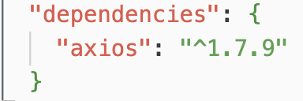

# Come iniziare un progetto

Per iniziare un progetto : `npm init`

Fornisci quello che ti viene chiesto, e crea il file **package.json**

# Ma a cosa serve il package?

Dopo aver fornito come script "dev", con il relativo comando 'node main.js', se a terminale inseriamo
`npm run dev`
Il main del progetto verrà quindi eseguito.

In [questo](https://www.npmjs.com/package/react) sito si possono trovare vari pacchetti già fatti appositi per react

Quindi, installiamo un package già fatto come **Axios**

`npm install axios`

fatto ciò, verrà quindi aggiunto al nostro progetto il file **package-lock.json**

# Dipendenze

Quando installo un package nel mio progetto, possiamo notare come viene aggiunta la **dipendenza** nel nostro *package.json* originario

